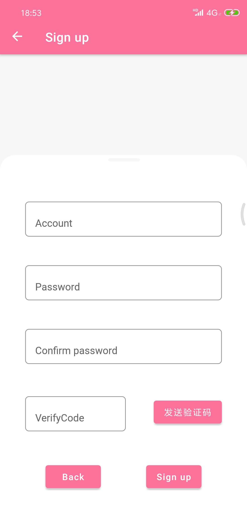
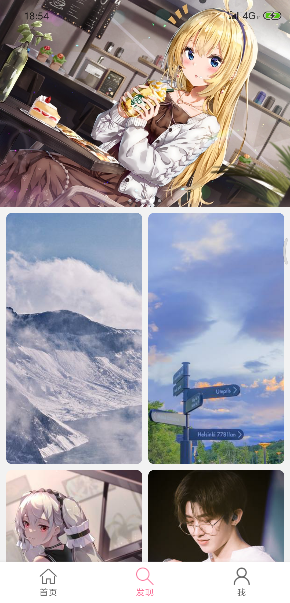

# 项目名称
阳光沙滩App
# 项目简介
该项目使用MVVM架构搭建，主要使用阳光沙滩社区开放Api实现相关功能，正在持续更新中...
# 版本信息
当前版本：1.0
# 技术栈
Kotlin、Glide、EasyHttp、Retrofit、OkHttp、BRVAH、XXPermissions、AndroidUtilCode、Room、UmengSDK、MiPush。

# 项目截图

<figure class="half">
    
    
    
    
    
</figure>

 

# 关于作者

作者昵称：A Lonely Cat、anjiemo
github：https://github.com/anjiemo
gitee：https://gitee.com/anjiemo

# 体验地址
[点击下载](https://wwa.lanzoui.com/ilD2yq91c8b)

